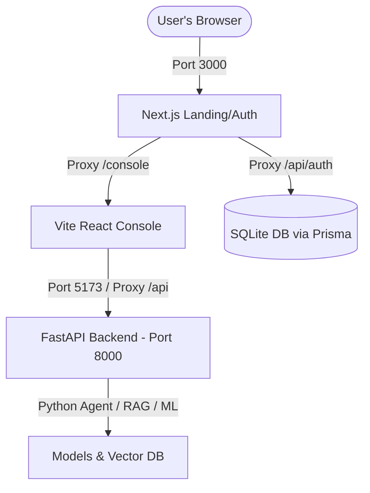

# Sentinel AI — Deployment & Integration Guide

This guide describes how to run and deploy the unified Sentinel AI platform. This document is structured for both human developers and AI coding agents.

---

## System Architecture

Sentinel AI consists of three interconnected systems:



1. **Next.js (`/landing`):** The primary host server (runs on Port 3000). Handles landing page, user registration/login, DB connections, and route middleware protection.
2. **Vite React (`/frontend`):** Client-side investigation console (runs on Port 5173 in dev; compiled to static files in production).
3. **FastAPI (`/api`):** Python backend (runs on Port 8000) containing the LangGraph agent, Chroma vector database, and XGBoost fraud models.

---

## Local Development Startup

To run all three services simultaneously in development mode, open PowerShell at the project root and run:

```powershell
.\start-all.ps1
```

This starts:
- **FastAPI backend** on `http://localhost:8000`
- **React Frontend Console** on `http://localhost:5173`
- **Next.js Webserver** on `http://localhost:3000` (Visit this in your browser)

---

## Production Deployment Flow

To deploy the entire system on a single domain or hosting provider:

### Step 1: Build the Vite React Frontend
Compile the React frontend into static assets:
```bash
cd frontend
npm install
npm run build
```
This outputs production-ready files in `frontend/dist/`.

### Step 2: Inject static assets into Next.js (No CORS setup required)
For a single-domain deploy, copy the built static files from `frontend/dist/` into the Next.js `landing/public/console/` directory:
```powershell
# PowerShell
Remove-Item -Recurse -Force -ErrorAction SilentlyContinue landing/public/console
New-Item -ItemType Directory -Force landing/public/console
Copy-Item -Path frontend/dist/* -Destination landing/public/console/ -Recurse -Force
```
*Note: Once copied to `public/console/`, Next.js will serve the React console at `/console/index.html` natively without running a separate Vite dev server.*

### Step 3: Run the Next.js Production Build
```bash
cd landing
npm install
npx prisma generate
npm run build
```
Start the production server:
```bash
npm start
```
Next.js will serve on Port 3000.

### Step 4: Run the FastAPI Python Production Server
Deploy the python server using `uvicorn`:
```bash
pip install -r requirements.txt
uvicorn api.main:app --host 0.0.0.0 --port 8000 --workers 4
```

---

## Context Rules for AI Agents

> [!IMPORTANT]
> **Instructions for AI Agents working on this repository:**
> 1. **Do not move core directories** out of their respective folders (`/landing`, `/frontend`, `/api`). Doing so breaks dependencies and lockfiles.
> 2. **Authentication Route Guards:** Route middleware is handled via `landing/src/proxy.ts` (Next.js 16 Proxy convention).
> 3. **API Routing:** Next.js proxies `/console` requests to the React frontend and `/api/aml` requests to the FastAPI backend. Keep these configurations synced in `landing/next.config.ts`.
