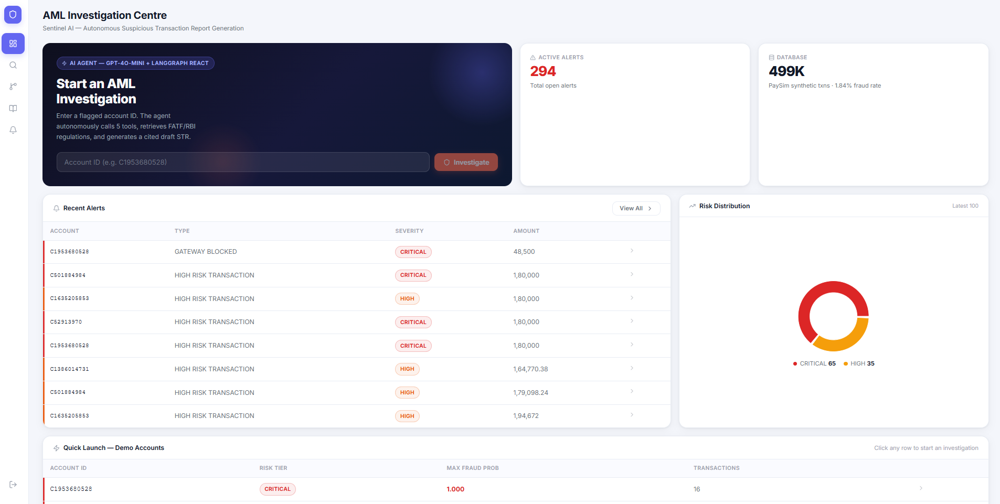
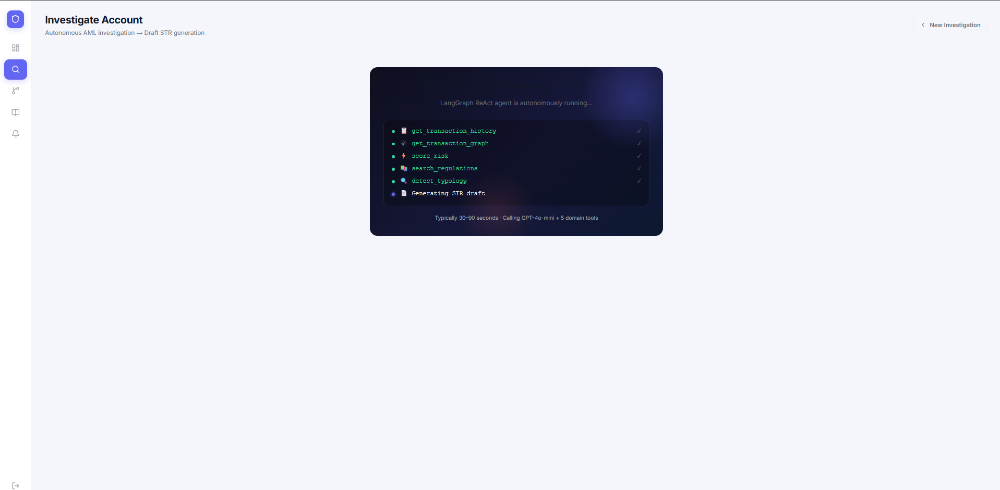
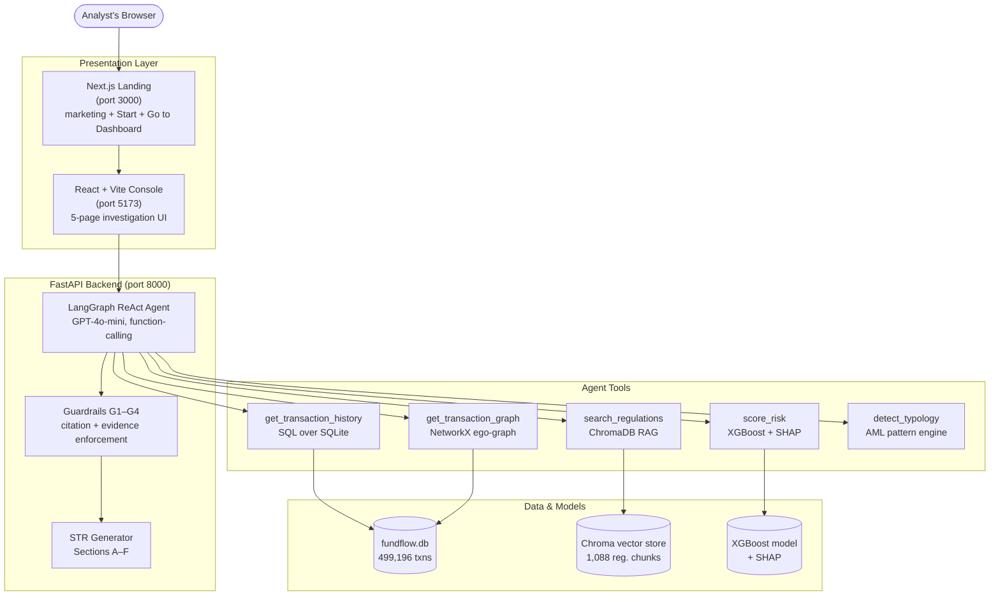

# Sentinel AI — AML Investigation Agent

> **PS6 Hackathon Submission** | AI for Digital Public Safety: Defeating Counterfeiting, Fraud & Digital Arrest Scams

[](https://python.org)
[](https://langchain-ai.github.io/langgraph/)
[](https://xgboost.readthedocs.io/)
[](https://trychroma.com)
[](https://react.dev)
[](https://nextjs.org)

---

## Table of Contents

- [What is Sentinel AI?](#what-is-sentinel-ai)
- [Screenshots](#screenshots)
- [Architecture](#architecture)
- [Key Features](#key-features)
- [Sample STR Output](#sample-str-output)
- [Project Structure](#project-structure)
- [Quickstart](#quickstart)
- [Demo Accounts](#demo-accounts)
- [Datasets & Data Provenance](#datasets--data-provenance)
- [Judging Alignment (PS6 Criteria)](#judging-alignment-ps6-criteria)
- [Limitations & Honest Disclosures](#limitations--honest-disclosures)
- [How We Built It](#how-we-built-it)
- [Deployment](#deployment)
- [Team](#team)

---

## What is Sentinel AI?

Sentinel AI is an **autonomous AML (Anti-Money Laundering) investigation platform** that takes a flagged bank account ID and produces a fully-cited, human-ready draft Suspicious Transaction Report (STR) — the document Indian financial institutions file with FIU-IND under PMLA, 2002.

A compliance analyst enters one account ID. The AI agent takes over: it queries transaction history, traces the fund-flow graph, scores fraud risk with XGBoost, retrieves relevant FATF/RBI/FinCEN regulatory passages via RAG, detects money laundering typologies, and synthesises everything into a structured draft STR — typically in under 90 seconds (measured on test hardware).

**The human analyst reviews, verifies, and files. The agent does the hours of data assembly.**

---

## Screenshots

> _Drop your images into `docs/screenshots/` and they'll render below. Suggested captures: the landing page, the Investigate page mid-run (agent logs streaming), the GraphView fund-flow graph, and a rendered STR._

<!-- Replace these placeholders with real screenshots before submitting. -->

| Landing | Investigation (live agent) |
|---|---|
|  |  |

| Fund-flow graph | Draft STR output |
|---|---|
|  |  |

<!-- Even better: add a short demo GIF here -->
<!--  -->

---

## Architecture



**RAG corpus (1,088 chunks, Chroma + `all-MiniLM-L6-v2`):** FATF Recommendations 2012 (updated 2023), RBI KYC/AML Master Direction 2016 (updated 2023), FinCEN SAR Activity Review, and MHA Annual Report 2023–24 (Digital Arrest / Cybercrime).

---

## Key Features

### Autonomous Investigation Agent
- **LangGraph ReAct loop** — the LLM selects which tool to call next based on what it has seen so far. It is not a hardcoded pipeline. If an account has zero transactions, the agent terminates early. If risk is LOW, it may skip typology analysis.
- **5 specialised tools** that the agent chains autonomously.
- **Guardrails system** — enforces minimum tool calls, requires regulatory citation before STR generation, and flags uncited regulatory claims (hallucination detection).

### Fund Flow Graph Engine
- SQL-first ego-subgraph construction that queries the full 499K-transaction database for every account's 2-hop neighbourhood — never pre-truncated, always correct regardless of account position.
- **Mule-account scoring** — `mule_score` is a **weighted composite of 6 signals** (capped at 1.0): passthrough ratio (0.30), rapid forward-delay of funds (0.25), fan-in from unique senders (0.20), account recency (0.15), transaction-amount clustering (0.10), and an Aadhaar OTP-eKYC-on-new-account boost (0.15).
- Ring / circular fund-flow detection using `networkx.simple_cycles()` on a bounded ego-subgraph (fast, not exponential).
- Full NetworkX DiGraph construction with weighted edges (transaction amount) and node risk attributes.

### ML Risk Scoring
- XGBoost model trained on our PaySim-derived, Indian-adapted dataset (`scale_pos_weight` tuned for class imbalance, `eval_metric=aucpr`).
- SHAP explainability via XGBoost's native `predict_contribs()`: top-5 feature contributions per prediction.
- Risk tiers: LOW / MEDIUM / HIGH / CRITICAL with configurable thresholds.

### Regulatory RAG
- 1,088 chunks from 4 real regulatory documents ingested into ChromaDB.
- `all-MiniLM-L6-v2` embeddings (local, no API cost).
- Every STR citation includes document name + page number.

### AML Typology Detection
- **Structuring** — pattern-based clustering near account ceiling (dataset-agnostic).
- **Velocity burst** — transactions-per-hour spike detection.
- **Mule account** — passthrough ratio + `mule_score` ≥ 0.6.
- **Round-tripping** — circular fund flow within a 48h window.
- **Smurfing** — fan-in from ≥ 5 unique senders.

### Guardrails (Citation Enforcement)
- **G1** — Agent must call ≥ 3 tools before STR generation.
- **G2** — At least 1 RAG citation required in every STR.
- **G3** — `score_risk` must be called; warns if `fraud_probability` < 0.6.
- **G4** — Flags uncited FATF/FinCEN claims (whitelists PMLA/RBI/FIU-IND as statutory boilerplate; SEBI not in corpus).

---

## Sample STR Output

> The block below is a **real, abridged excerpt** of the actual output produced by `python test_agent.py` (saved to `test_str_output.txt`) for demo account `C1953680528`. Nothing here is mocked.

<details>
<summary><b>Click to expand a real draft STR</b></summary>

```
╔══════════════════════════════════════════════════════════════╗
║   SENTINEL AI — DRAFT SUSPICIOUS TRANSACTION REPORT (STR)     ║
║        [INTERNAL COMPLIANCE DRAFT — NOT COURT-ADMISSIBLE]     ║
╚══════════════════════════════════════════════════════════════╝

REPORT METADATA
  Subject Acct  : C1953680528
  Risk Tier     : HIGH
  Fraud Prob    : 0.7725
  Filing Basis  : Prevention of Money Laundering Act, 2002 (PMLA)
                  RBI KYC/AML Master Direction 2016 (updated 2023)

SECTION A — ACCOUNT SUMMARY
  Total Transactions   : 16      Fraud-flagged Txns : 16
  Total Amount Sent    : 371,331.19 (synthetic units)
  Period               : 2026-03-10 -> 2026-03-29
  Dataset Note         : Amounts are PaySim synthetic units (not INR).

SECTION B — GRAPH INTELLIGENCE
  Out-degree (unique receivers): 16     In-degree: 0
  Max Fraud Prob on Node       : 0.9998
  Mule Score                   : 0.0000     In Circular Ring: False

SECTION C — ML RISK SCORING (XGBoost + SHAP)
  Fraud Probability   : 0.7725     Decision Threshold: 0.70
  Top SHAP Feature Contributions:
  • sender_avg_amount: +225.02
  • amount_log:        +0.28
  • type_ATM:          +0.09
  • is_night:          +0.06

SECTION E — REGULATORY BASIS (RAG Citations)
  [1] FATF Recommendations 2012 (updated 2023) (p.40): "..."
  [2] FATF Recommendations 2012 (updated 2023) (p.25): "..."

SECTION F — INVESTIGATION RECOMMENDATION
  [ESCALATE] Immediate review recommended
  3. If confirmed: consider filing STR with FIU-IND per Section 12
     of PMLA, 2002 (7 working days from date of suspicion).

  DISCLAIMER: AI-generated DRAFT for internal compliance use only.
  NOT a filed STR, NOT legal advice, NOT court-admissible evidence.
```

</details>

---

## Project Structure

```
E:\PS6\
├── agent/
│   ├── orchestrator.py     # LangGraph ReAct agent — main investigation loop
│   ├── tools.py            # 5 agent tools (history, graph, risk, RAG, typology)
│   ├── str_generator.py    # Draft STR formatter (Sections A–F)
│   └── guardrails.py       # Citation + evidence enforcement (G1–G4)
│
├── rag/
│   ├── ingest.py           # PDF → chunks → ChromaDB (run once)
│   ├── retriever.py        # Semantic search over regulatory corpus
│   ├── corpus/             # Place regulatory PDFs here
│   └── vector_store/       # Chroma persistent store (auto-created)
│
├── frontend/               # React + Vite investigation console (port 5173)
│   ├── src/pages/          # 5 pages (Dashboard, Investigate, GraphView, RAGLookup, Alerts)
│   └── src/index.css       # Custom design system with risk tokens
│
├── landing/                # Next.js 16 landing page (port 3000) — public entry point
│   ├── public/             # Pre-built Nuxt/Vue marketing site + "Go to Dashboard" button
│   └── src/app/            # Next.js routes serving the landing + asset proxy
│
├── api/
│   └── main.py             # FastAPI backend (agent, graph, RAG, alerts endpoints)
│
├── console/
│   └── app.py              # Legacy Streamlit 4-tab console (fallback)
│
├── models/                 # XGBoost fraud model (trained by us on PaySim)
├── graph/                  # Fund flow graph engine (NetworkX)
├── features/               # 49-feature engineering pipeline
├── explainability/         # SHAP via XGBoost native predict_contribs
├── scoring/                # Composite risk + alert engine
│
├── start-all.ps1           # One-command dev startup (backend + console + landing)
├── run_ps6.py              # Startup script (--ingest / --console)
├── test_agent.py           # End-to-end agent test
├── test_rag.py             # RAG retrieval test
├── requirements_ps6.txt    # All dependencies (USE THIS ONE)
├── README.md
├── DEPLOYMENT.md           # Local dev startup
└── DEPLOYMENT_PRODUCTION.md # Real-world hosting guide
```

---

## Quickstart

### 1. Prerequisites
- Python 3.11+
- Node.js 20+ (for the React console and Next.js landing)
- An OpenAI API key

### 2. Environment setup

```powershell
# Create / activate the project virtual environment (repo root: E:\PS6)
python -m venv .venv
.\.venv\Scripts\activate

# Install ALL dependencies (agent, RAG, ML) — use requirements_ps6.txt, NOT requirements.txt
pip install -r requirements_ps6.txt
```

### 3. Configure environment variables

Copy `.env.example` to `.env` and fill in:

```env
OPENAI_API_KEY=sk-proj-...your-key...
PS6_DB_PATH=E:\PS6\fundflow.db
CHROMA_DB_PATH=E:\PS6\rag\vector_store
AGENT_LLM_MODEL=gpt-4o-mini
AGENT_MAX_STEPS=10
AGENT_EVIDENCE_THRESHOLD=0.6
```

### 4. Ingest the RAG corpus (once)

```bash
# Place regulatory PDFs in rag/corpus/ then:
python run_ps6.py --ingest
# Expected: ~1088 chunks ingested across 4 documents
```

### 5. Launch everything (recommended: one command)

From the repo root in PowerShell:

```powershell
.\start-all.ps1
```

This starts all three services:
- **FastAPI backend** → http://localhost:8000
- **React console** → http://localhost:5173
- **Next.js landing** → http://localhost:3000  ← open this in your browser

<details>
<summary>Or start each service manually</summary>

```bash
# Terminal 1 — backend
uvicorn api.main:app --reload            # http://localhost:8000

# Terminal 2 — console
cd frontend && npm install && npm run dev # http://localhost:5173

# Terminal 3 — landing
cd landing && npm install && npm run dev  # http://localhost:3000
```
</details>

### 6. Run the end-to-end agent test

```bash
python test_agent.py
# Investigates account C1953680528 (16 txns, all fraud-flagged; scored 0.7725 / HIGH in the reference run)
# Output: full cited STR saved to test_str_output.txt
```

---

## Demo Accounts

High-risk demo accounts — every transaction on each is fraud-flagged in the dataset. Exact fraud probability and risk tier are **computed live per model run** (e.g. `C1953680528` scored `0.7725` / **HIGH** in the reference test run above).

| Account ID | Transactions | Fraud-flagged Txns |
|---|---|---|
| `C1953680528` | 16 | 16 |
| `C658156224` | 15 | 15 |
| `C832102131` | 14 | 14 |
| `C111612613` | 13 | 13 |

---

## Datasets & Data Provenance

| Data | Source | Status |
|---|---|---|
| Transaction data | PaySim → transformed to Indian banking context (NEFT/UPI/IMPS/ATM/DEPOSIT, Indian branches & channels) → FundFlow-augmented | Synthetic base — amounts are not INR |
| Fraud rate (1.84%) | FundFlow rebalanced PaySim | Higher than raw PaySim's ~0.13% by design |
| Regulatory corpus | Real PDFs (FATF, RBI, FinCEN, MHA) | Real regulatory documents |

**How PaySim was adapted to an Indian banking context** (`ingestion/preprocess.py`):
- **Transaction types → Indian rails:** `TRANSFER→NEFT`, `PAYMENT→UPI`, `DEBIT→IMPS`, `CASH_OUT→ATM`, `CASH_IN→DEPOSIT`
- **Branches:** each account is deterministically mapped to one of 25 Indian branch codes across 16 cities (Mumbai, Delhi, Chennai, Bengaluru, Hyderabad, Kolkata, Pune, …)
- **Channels:** `mobile` / `internet` / `branch` added with a mobile-first weighting (0.45 / 0.35 / 0.20) and a night-hours skew toward digital channels
- **Timestamps:** PaySim's hourly `step` expanded into realistic datetime values
- **Schema:** columns renamed to an Indian-bank format (`sender_account`, `sender_branch`, `is_fraud`, …)
- **AML typologies:** smurfing, round-tripping, rapid multi-hop, and dormant-account activation injected via `data/augment.py`

> **Disclosure:** All transaction data is synthetic (PaySim-derived, then transformed into an Indian banking schema — see `ingestion/preprocess.py`). Amounts are in synthetic units, not INR. Absolute regulatory thresholds (e.g. PMLA ₹10L) are not applicable to this dataset. The fraud rate of 1.84% reflects FundFlow's rebalanced training set. All STR outputs are internal compliance drafts for human analyst review — not court-admissible evidence.

---

## Judging Alignment (PS6 Criteria)

| Criterion | Weight | How We Address It |
|---|---|---|
| Innovation | 30% | LangGraph ReAct agent autonomously chains 5 domain-specific AML tools; genuine function-calling LLM orchestration (not a pipeline) |
| Technical Implementation | 30% | XGBoost + SHAP, NetworkX ego-graph, ChromaDB RAG, LangGraph — all integrated end-to-end |
| Scalability | 15% | Modular tool design; SQL-based graph construction (no pre-truncation); vector store scales to full corpus |
| User Experience | 15% | Next.js landing + 5-page React console; premium Dribbble-inspired UI; real-time agent execution animation; risk-accent borders; full cited STR output |
| Impact | 10% | Directly addresses FIU-IND STR filing workflow; reduces AML analyst assembly time from hours to minutes (tested at ~90s per investigation) |

---

## Limitations & Honest Disclosures

1. **Synthetic base data, transformed to an Indian banking context** — We start from **PaySim** (a synthetic mobile-money dataset) and transform it into an Indian bank transaction dataset via `ingestion/preprocess.py`: PaySim's payment types are remapped to Indian rails (`TRANSFER→NEFT`, `PAYMENT→UPI`, `DEBIT→IMPS`, `CASH_OUT→ATM`, `CASH_IN→DEPOSIT`), accounts are assigned Indian branch codes across 16 cities, transaction channels (mobile/internet/branch) and realistic timestamps are added, and columns are renamed to an Indian-bank schema. AML typologies are then injected via `data/augment.py`. The data remains **synthetic** — the underlying behavioural patterns are PaySim's and amounts are in synthetic units, not INR — but the schema and semantics mirror a real Indian bank export, and the architecture is data-agnostic enough to run on one.
2. **No real-time streaming** — Transactions are batch-loaded into SQLite, not ingested in real-time.
3. **Graph is ego-subgraph only** — For performance, graph analysis is scoped to the 2-hop neighbourhood. The full 499K-transaction graph is not traversed during investigation.
4. **STR is a draft** — All outputs require human compliance officer review before any regulatory filing.
5. **Typology thresholds are relative** — Structuring detection uses an account-relative amount ceiling, not absolute INR thresholds (which are meaningless on synthetic data).
6. **Corpus composition** — The MHA report is the largest share of the RAG corpus, so retrieval quality for FATF/RBI/FinCEN queries benefits from the guardrail citation checks.

---

## How We Built It

Sentinel AI was built in two phases:

### Phase 1 — ML Foundation (FundFlow)
We built a complete transaction fraud detection stack from scratch:
- **Data pipeline:** Parsed, cleaned, and mapped PaySim's transaction types to Indian banking conventions (UPI/NEFT/ATM/IMPS); built the SQLite schema and loaded 499,196 transactions.
- **Feature engineering:** Implemented 49 features across 6 categories — transaction-level signals, rolling velocity (1h/24h), new-receiver flags, cross-bank UPI detection, structuring-threshold proximity, graph-derived signals (mule score, passthrough ratio), and India-specific features (KYC risk tier, CIBIL credit flag).
- **Model training:** Trained an XGBoost binary classifier with `scale_pos_weight` for imbalance and `eval_metric=aucpr`. Achieved **PR-AUC = 0.72, Recall = 0.82 at threshold 0.70**.
- **Graph engine:** Built `graph/fund_flow.py` (NetworkX DiGraph), `graph/mule_detector.py` (the 6-signal weighted mule score), and `graph/ring_detector.py` (ego-bounded simple-cycles). Constructed ego-subgraphs via SQL rather than loading the full 499K graph into memory.
- **SHAP explainability:** Integrated XGBoost's native `predict_contribs()` (true log-odds SHAP values per feature, no external shap package needed).
- **Alert generation:** `scoring/composite.py` applies rule-based + ML thresholds and writes structured alerts to the SQLite `alerts` table.

### Phase 2 — Agentic Investigation Layer (Sentinel AI)
Built on top of the ML foundation:
- **LangGraph ReAct agent** — orchestrates the 5 tools autonomously using GPT-4o-mini function-calling. Tool order is not hardcoded; the LLM decides based on what each tool returns.
- **Regulatory RAG** — ingested 4 real regulatory PDFs (1,088 chunks) into ChromaDB with source→display-name mapping for clean citations.
- **STR generator** — formats all tool evidence into a 6-section draft STR aligned to FIU-IND/RBI/PMLA structure.
- **Guardrail system** — enforces citation requirements and minimum evidence before STR generation (G1–G4).
- **FastAPI backend** — async investigation endpoint with job polling, graph endpoint, RAG search, and alerts API.
- **React + Vite console** — 5-page intelligence dashboard with a Dribbble-matched design system, real-time agent logs, interactive graph visualisations, and risk-based colour tokens.
- **Next.js landing** — a polished public entry page with a single **Start** intro and a **Go to Dashboard** button into the console.
- **Streamlit console** — legacy 4-tab UI kept as a fallback (`console/app.py`).

---

## Deployment

- **Local development:** see [`DEPLOYMENT.md`](./DEPLOYMENT.md) (or just run `.\start-all.ps1`).
- **Production / real hosting:** see [`DEPLOYMENT_PRODUCTION.md`](./DEPLOYMENT_PRODUCTION.md) — a full teach-you-how guide (Oracle Cloud Free Tier backend + Vercel frontends, Docker, HTTPS, and this project's specific gotchas).

---

## Team

**Team SPIRIT** — PS6 Hackathon 2026
*AI for Digital Public Safety*

---

*All STR outputs generated by this system are AI-generated internal compliance drafts.
They are NOT filed STRs, NOT legal advice, and NOT court-admissible evidence.
Independent verification by a certified compliance officer is required before any regulatory action.*
